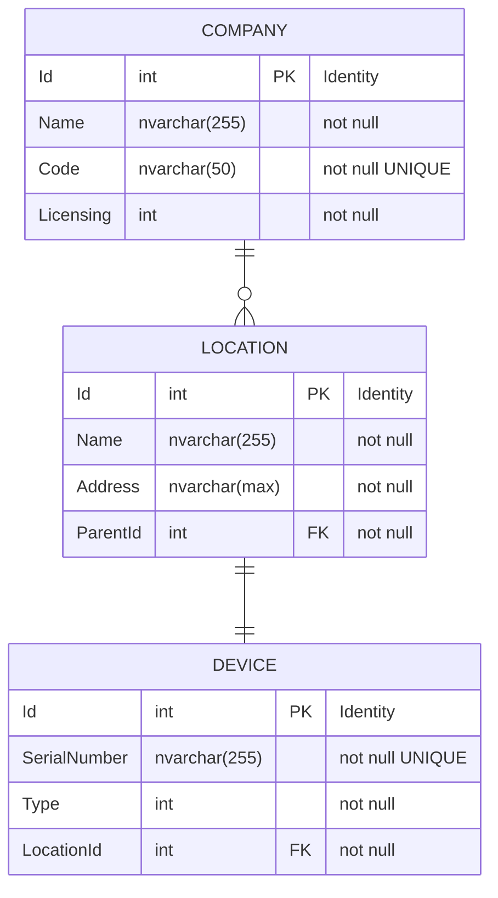

# Mood Media Kata
## Kata
### Given
- The database diagram in the databaseDiagram.jpeg file.   

- Two action/message types:
- Create Company - json payload can be found in createCompany.json  
```json
{
   "Id":"0BA545F1-64C8-487C-988F-1B466A06B30F",
   "MessageType":"NewCompany",
   "CompanyName":"My Company 1",
   "CompanyCode":"COMP-123",
   "Licensing":"Standard",
   "Devices":[
      {
         "OrderNo":"1",
         "Type":"Standard"
      },
      {
         "OrderNo":"2",
         "Type":"Custom"
      }
   ]
}
```
- Delete Devices - json payload can be found in deleteDevices.json  
```json
{
   "Id":"0BA545F1-64C8-487C-988F-1B466A06B30F",
   "MessageType": "DeleteDevices",
   "SerialNumbers": ["Serial1", "Serial2"]
}
```

### Then
- Build a .NET console application to process the two message types above and perform
the necessary actions according to the MessageType property of the payload:
- Create Company:
  -  Messages of type NewCompany.
  - A new Company entity with its associated Location(s) and Device(s)
entities must be created in the database
  - Locations will be named using the following format: Location {index}
  - For each entity within the Devices array of the message payload, an
individual location must be created.
  - E.g. the first device in the list goes to Location 1, the second
device goes to Location 2, etc.
  - Each device has a unique serial number which must be generated by the
application. Please use whatever technique you choose to achieve this.
  - The type of a device can be: Custom or Standard.
- Delete devices
  - Messages of type DeleteDevices.
  - The SerialNumbers array of the message payload contains the serial
numbers of the devices to be deleted.
### Observations
- The goal of this exercise is to show off your coding skills. Performance of the application
is not important.
- Tests are advisable but we do not require a TDD approach or specific coverage.
- No Entity Framework. We’d like to see how you write queries.

## Solution
### Design Overview

### Use Cases

### Technologies